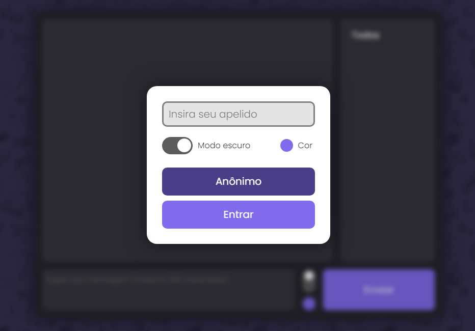
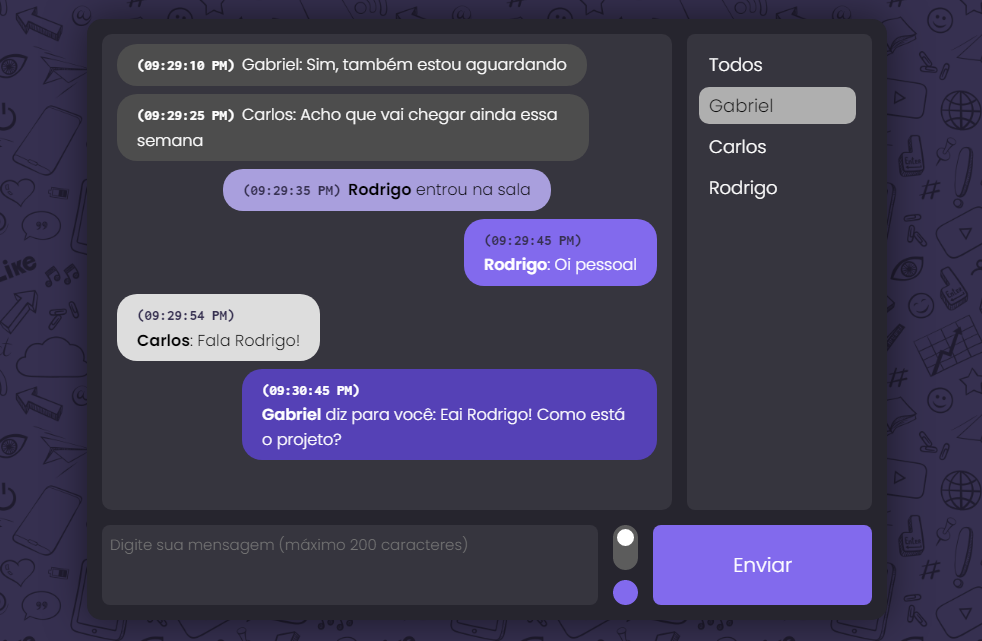

# Online-chat
### Uma sala de bate papo simples e dinâmica para conversar com seus amigos!

O projeto consiste numa sala de bate-papo online, utilizando principalmente socket.IO e nodeJS para a conexão.
Para começar, digite seu apelido ou entre de forma anônima.

### Sobre
A interface principal conta com um histórico de mensagens, uma lista com os usuários ativos e o campo de envio da mensagem. Após o envio, sua mensagem será encaminhada para todos os usuários na sala. Caso um usuário em específico seja selecionado, sua mensagem será enviada apenas para ele.

Cada tipo de mensagem tem um estilo diferente de acordo com seu tipo. Também é possível selecionar as cores principais e ativar o modo escuro para melhor visualização.

### Tecnologias utilizadas:
- CSS3
- JavaScript
- NodeJS
- Socket.IO 
